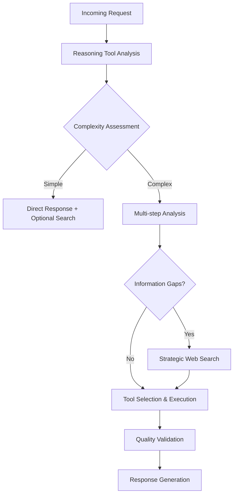
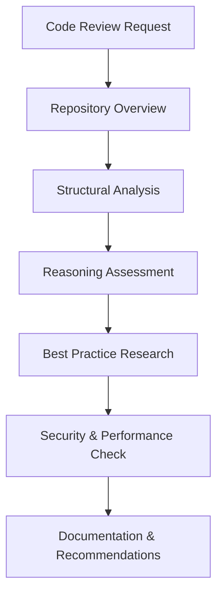
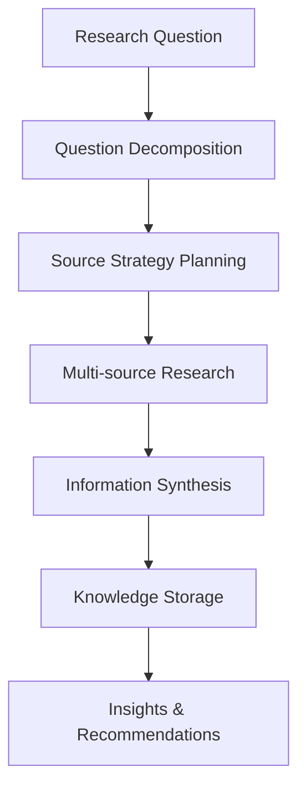

# 🧠 AI Cognitive Workflow Map: Advanced Tool Orchestration Guide

**Version**: 1.0  
**Purpose**: Comprehensive guide for intelligent tool usage in request analysis, code review, and deep reasoning  
**Target**: Future AI sessions requiring structured problem-solving approaches

---

## 🎯 Core Philosophy

**COGNITIVE-FIRST APPROACH**: Always begin with reasoning tools to understand the problem before selecting execution tools. Think, then act.

**ADAPTIVE WORKFLOWS**: Workflows should be contextual and adaptive rather than rigid sequences. Adjust based on complexity and requirements.

**QUALITY ASSURANCE**: Include validation checkpoints, source verification, and continuous improvement loops.

---

## 📊 Tool Taxonomy & Decision Matrix

### 🧩 REASONING TOOLS (Primary Analysis)
| Tool | Best For | Key Features |
|------|----------|--------------|
| `mcp-reasoner` | Complex multi-pathway analysis | Beam search, MCTS strategies, exploration of alternatives |
| `code-reasoning` | Sequential problem-solving | Branching, revision capabilities, step-by-step analysis |
| `sequentialthinking` | Adaptive thinking processes | Dynamic thought adjustment, context building |

**Decision Rule**: Start with reasoning tools for ANY complex request. Use for problem decomposition, architecture decisions, and when multiple approaches need evaluation.

### 🔍 INFORMATION GATHERING TOOLS (Strategic Research)
| Tool | Purpose | Usage Guidelines |
|------|---------|------------------|
| `web_search` / `brave_web_search` | Current information, best practices | Use for recent events, industry standards, technical documentation |
| `web_fetch` | Detailed content retrieval | Follow-up to search for comprehensive analysis |
| `google_drive_search` | Internal/company documents | Prioritize for proprietary information, internal policies |
| `google_drive_fetch` | Specific document content | Direct access to known documents |

**Decision Rule**: 
- **Current events/recent info** → Web search MANDATORY
- **Internal/company context** → Google Drive search PRIORITY  
- **Technical best practices** → Web search + authoritative source validation

### 💻 CODE ANALYSIS TOOLS (Development Focus)
| Tool Category | Tools | Application |
|---------------|-------|-------------|
| **Repository Analysis** | `git_status`, `git_diff`, `git_log` | Understanding project state and history |
| **Code Structure** | `directory_tree`, `filesystem`, `grep_ast` | Architectural analysis and pattern detection |
| **Code Search** | `grep`, `search`, `advanced-search` | Pattern matching and code exploration |
| **GitHub Integration** | GitHub API tools | Repository management, PR analysis, issue tracking |

**Decision Rule**: Always start with `directory_tree` and `git_status` for repository overview, then use `grep_ast` for structural analysis.

### 🧠 KNOWLEDGE MANAGEMENT TOOLS (Persistence)
| Tool | Function | Strategic Use |
|------|----------|---------------|
| `memory` (knowledge graph) | Entity-relationship storage | Cross-session context, project mapping |
| `taskmanager` | Structured workflow management | Multi-step projects, milestone tracking |

**Decision Rule**: Use for complex projects requiring context persistence and for building institutional knowledge.

### ⚡ EXECUTION TOOLS (Validation & Automation)
| Tool | Purpose | Integration Points |
|------|---------|-------------------|
| `puppeteer`, `browsermcp` | Browser automation | Testing, web scraping, UI validation |
| `server-win-cli` | Command execution | System operations, script running |
| `n8n-workflow-builder` | Process automation | Workflow creation and management |

---

## 🚀 Core Workflow Templates

### 1️⃣ REQUEST ANALYSIS WORKFLOW



**Implementation Steps:**
1. **COGNITIVE ANALYSIS** (Required)
   ```
   Use: mcp-reasoner or code-reasoning
   Purpose: Break down request, identify complexity, determine approach
   Duration: 1-3 reasoning iterations
   ```

2. **INFORMATION STRATEGY** (Conditional)
   ```
   Triggers: Knowledge gaps, current events, best practices needed
   Tools: web_search → web_fetch for detailed analysis
   Quality: Prioritize authoritative sources, cross-reference
   ```

3. **EXECUTION SELECTION** (Adaptive)
   ```
   Code-related: Code Analysis Tools + Reasoning Tools
   Research-heavy: Information Gathering + Knowledge Management
   Multi-step: Task Management + Phased approach
   ```

### 2️⃣ CODE REVIEW WORKFLOW



**Implementation Steps:**
1. **REPOSITORY CONTEXT**
   ```bash
   directory_tree(path, depth=3)
   git_status(repo_path)
   git_log(repo_path, max_count=10)
   ```

2. **CODE STRUCTURE ANALYSIS**
   ```bash
   grep_ast(pattern="class|function|interface", path=repo_path)
   # Focus on architectural patterns, naming conventions, organization
   ```

3. **REASONING-BASED ASSESSMENT**
   ```bash
   code-reasoning: Analyze architecture decisions, design patterns, potential issues
   # Multi-step analysis with revision capabilities
   ```

4. **CURRENT BEST PRACTICES**
   ```bash
   web_search("code review best practices [technology] [year]")
   web_search("security vulnerabilities [framework] latest")
   ```

5. **QUALITY CHECKPOINTS**
   - Security validation (authentication, authorization, input validation)
   - Performance considerations (algorithms, database queries, caching)
   - Maintainability assessment (code clarity, documentation, testing)

### 3️⃣ DEEP RESEARCH WORKFLOW



**Implementation Steps:**
1. **QUESTION BREAKDOWN**
   ```bash
   mcp-reasoner: Break complex research into sub-questions
   Strategy: beam_search for exploring multiple research pathways
   ```

2. **SOURCE STRATEGY**
   ```
   External: web_search for academic, industry, technical sources
   Internal: google_drive_search for company context
   Current: Prioritize recent information for rapidly changing topics
   ```

3. **SYNTHESIS & STORAGE**
   ```bash
   Reasoning tools: Connect findings, identify patterns, generate insights
   Knowledge graph: Store entities, relationships, key findings
   Task management: Track research progress and next steps
   ```

---

## 🎛️ Decision Framework & Tool Selection

### COMPLEXITY-BASED ROUTING

| Request Complexity | Tool Strategy | Example Approach |
|-------------------|---------------|------------------|
| **Simple Factual** | Direct response + optional search | Answer directly, verify with search if needed |
| **Moderate Analysis** | Reasoning + targeted search | 1-2 reasoning cycles + specific research |
| **Complex Multi-step** | Full workflow orchestration | Reasoning → Research → Task management → Execution |

### INFORMATION CURRENCY MATRIX

| Information Type | Time Sensitivity | Tool Priority | Quality Validation |
|------------------|------------------|---------------|-------------------|
| **Current Events** | High | Web search FIRST | Multiple sources, recent dates |
| **Technical Standards** | Medium | Web search + documentation | Official sources, version checking |
| **Internal Policies** | Low | Google Drive search | Company-specific documents |
| **Historical Context** | Low | Knowledge base + light search | Cross-reference existing knowledge |

### DOMAIN-SPECIFIC ROUTING

| Request Domain | Primary Tools | Secondary Tools | Quality Focus |
|----------------|---------------|-----------------|---------------|
| **Code Review** | Code Analysis + Reasoning | Web search for best practices | Security, performance, maintainability |
| **Technical Research** | Reasoning + Web search | Knowledge management | Source authority, currency |
| **Project Planning** | Task management + Reasoning | All tools as needed | Feasibility, resource estimation |
| **Problem Debugging** | Reasoning + Code analysis | Execution tools for testing | Root cause identification |

---

## 🔍 Quality Assurance Framework

### VALIDATION CHECKPOINTS

1. **Source Verification**
   - Cross-reference multiple authoritative sources
   - Check publication dates for currency
   - Validate against official documentation

2. **Reasoning Validation**
   - Use multiple reasoning strategies for complex problems
   - Implement revision cycles for critical decisions
   - Document assumptions and limitations

3. **Implementation Testing**
   - Use execution tools for validation where possible
   - Test recommendations in controlled environments
   - Monitor results and iterate

### CONTINUOUS IMPROVEMENT

- **Feedback Loops**: Track which tool combinations work best for different request types
- **Knowledge Building**: Store successful patterns in knowledge graph
- **Strategy Refinement**: Update decision frameworks based on outcomes

---

## 🛠️ Practical Implementation Guide

### STARTING A NEW SESSION

1. **Context Restoration**
   ```bash
   read_graph()  # Review existing knowledge
   search_nodes("current project OR recent decisions")
   ```

2. **Request Assessment**
   ```bash
   mcp-reasoner(strategy="beam_search", thought="Analyze this request for complexity, requirements, and optimal approach")
   ```

3. **Tool Selection**
   - Use decision matrix above
   - Start conservative, scale up as needed
   - Document choices for future reference

### HANDLING COMPLEX REQUESTS

1. **Break Down Phase**
   ```bash
   code-reasoning: "Break this complex request into manageable sub-tasks"
   taskmanager: Create structured task list with dependencies
   ```

2. **Research Phase**
   ```bash
   web_search: Target current information and best practices
   google_drive_search: Look for relevant internal context
   ```

3. **Execution Phase**
   ```bash
   Apply appropriate tools based on sub-task type
   Maintain context through knowledge graph
   Regular quality checkpoints
   ```

### ERROR HANDLING & ITERATION

- **Information Gaps**: Use web search strategically, don't over-research
- **Tool Limitations**: Combine multiple tools for comprehensive coverage  
- **Quality Issues**: Implement validation loops and human-in-the-loop checkpoints
- **Context Loss**: Leverage knowledge graph for session continuity

---

## 📋 Quick Reference Cheat Sheet

### IMMEDIATE ACTIONS FOR COMMON SCENARIOS

| Scenario | Immediate Tools | Follow-up Strategy |
|----------|----------------|-------------------|
| **"Review this code"** | `directory_tree` → `grep_ast` → `code-reasoning` | Web search for best practices |
| **"Research X topic"** | `mcp-reasoner` → `web_search` → synthesis | Store in knowledge graph |
| **"Complex analysis needed"** | `mcp-reasoner` with multiple strategies | Iterative refinement |
| **"Current information about X"** | `web_search` → `web_fetch` → validation | Cross-reference sources |
| **"Help with project Y"** | `taskmanager` → `code-reasoning` → phased approach | Persistent context management |

### TOOL COMBINATIONS THAT WORK WELL

- **Deep Code Analysis**: `directory_tree` + `grep_ast` + `code-reasoning` + `web_search` (security patterns)
- **Research Synthesis**: `mcp-reasoner` + `web_search` + `web_fetch` + knowledge graph storage
- **Problem Solving**: `sequentialthinking` + domain-specific tools + validation tools
- **Project Management**: `taskmanager` + `code-reasoning` + `git` tools + knowledge persistence

---

## 🚀 Advanced Usage Patterns

### MULTI-SESSION PROJECTS
- Use knowledge graph for context continuity
- Implement task management for milestone tracking  
- Regular knowledge updates and relationship mapping

### COLLABORATIVE ANALYSIS
- Document reasoning processes for transparency
- Store decision rationales in knowledge graph
- Enable handoff between different AI sessions

### CONTINUOUS LEARNING
- Track successful tool combinations
- Build domain-specific workflow templates
- Refine decision frameworks based on outcomes

---

*This workflow map represents a living document. Update and refine based on experience and evolving requirements. The goal is intelligent tool orchestration that enhances rather than replaces human judgment.*